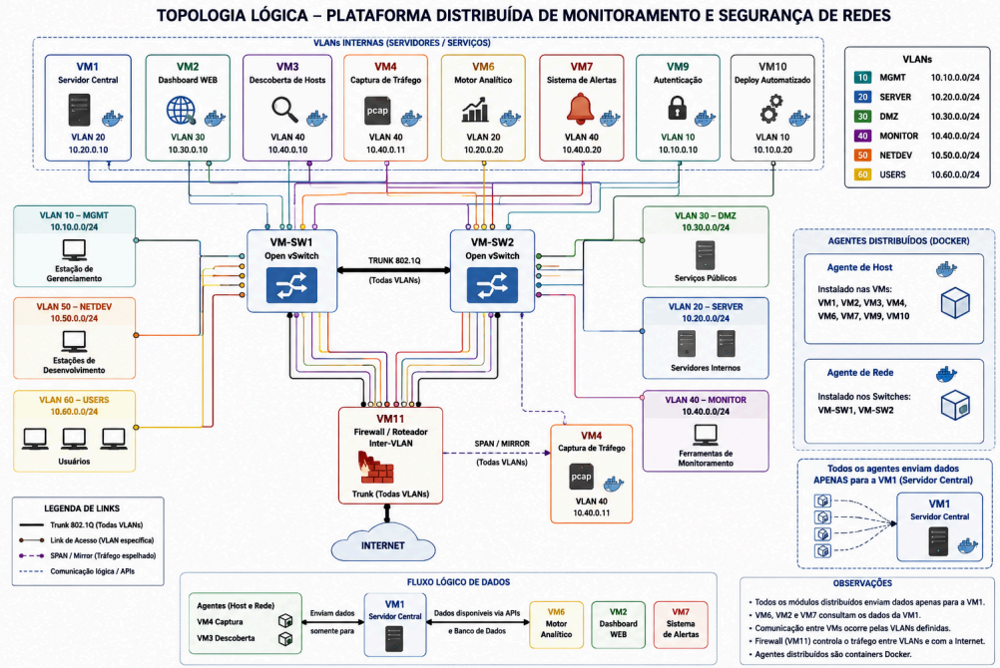

# 👨‍💻 Plataforma Distribuída de Monitoramento e Segurança de Redes

**🚀 Módulo de Orquestração e Deploy Automatizado (VM10)**


Projeto desenvolvido para a disciplina de Laboratório de Redes. 

Este repositório contém o memorial de execução de Infraestrutura como Código (IaC) e Gerência de Configuração responsáveis pelo provisionamento, estruturação de redes e implantação de serviços de uma plataforma distribuída operando em ambiente de nuvem OpenStack.

A solução aqui documentada corresponde às atribuições do **Deploy Automatizado (VM10)**, o nó central de orquestração da arquitetura.


---

## ☁️ Visão Geral da Arquitetura



A infraestrutura deste projeto é composta por múltiplas máquinas virtuais (VMs) com propósitos específicos, interligadas por switches virtuais (Open vSwitch) que segmentam o tráfego em múltiplas VLANs (Virtual LANs). 

A arquitetura exige que o provisionamento de hardware virtual e a instalação de softwares ocorram de forma padronizada e reproduzível. Para atingir este objetivo, o projeto adota uma abordagem de provisionamento declarativo e configuração imperativa centralizada.

A máquina **VM10** atua como o controlador de automação. Ela executa instruções contra a API do OpenStack para construir a topologia física e, subsequentemente, estabelece túneis criptografados via SSH com cada nó para injetar as configurações operacionais.

---

## 🚀 Função do Deploy Automatizado (VM10)

As responsabilidades do módulo de Deploy Automatizado incluem:

1. **Provisionamento Computacional (Terraform):** Comunicação com a API de Identidade (Keystone) e Computação (Nova) do OpenStack para instanciar 10 máquinas virtuais, alocar recursos de processamento (vCPU/RAM), discos físicos virtuais e injetar chaves públicas de acesso.
2. **Topologia de Rede (Terraform):** Conexão das interfaces de rede das instâncias aos barramentos (redes lógicas) pré-configurados no OpenStack, definindo a rede de gerência primária (`labredes1`) e as redes de trânsito secundárias (`VLAN20_SERVER`, `TRUNK_INTER_SW`, etc.).
3. **Gerenciamento de Configuração (Ansible):** Execução de *playbooks* modulares que instalam pacotes do sistema (Ubuntu), configuram regras de roteamento do kernel Linux (via Netplan) e implantam serviços em contêineres Docker de forma idempotente.
4. **Padronização de Roteamento:** Configuração das tabelas de roteamento das VMs para que o tráfego de internet e produção seja direcionado para o IP da VM11 (Firewall/Roteador), garantindo que as políticas de segurança `nftables` sejam respeitadas.

---

## 📋 Especificações Técnicas da VM10

A máquina orquestradora opera com os seguintes parâmetros alocados no OpenStack:

* **Flavor (Perfil de Hardware):** `light.micro.medium`
* **Processamento:** 2 vCPUs
* **Memória RAM:** 4 GB
* **Armazenamento:** 8 GB
* **Rede de Operação:** `VLAN10_DEPLOY` (Endereço: 10.0.110.8/24)
* **Rede de Gerência (OOBM):** `labredes1` (Endereço: 192.168.10.145)

A interface principal (`ens7`) está configurada de forma estática através da ferramenta Netplan, garantindo persistência na conexão com a sub-rede de provisionamento.

---

## 📁 Estrutura deste Repositório

Para garantir o isolamento de responsabilidades, o repositório é segmentado em dois diretórios principais:

```text
.
├── images/               # Diretório para diagramas e capturas de tela
│   └── topologia.png     # Imagem da arquitetura geral do projeto
│
├── terraform/
│   ├── main.tf           # Definição do provider OpenStack e autenticação
│   ├── variables.tf      # Mapeamento de instâncias, flavors e redes
│   ├── instances.tf      # Instruções de criação das VMs e geração do inventário
│   └── README.md         # Documentação específica de IaC
│
├── ansible/
│   ├── ansible.cfg       # Parâmetros de execução e localização do inventário
│   ├── hosts.ini         # Inventário dinâmico gerado pelo Terraform
│   ├── instalar_base.yml # Playbook de instalação de pacotes (Docker, OVS)
│   ├── configurar_*.yml  # Playbooks específicas de configuração por VM
│   └── README.md         # Documentação específica de Gerência de Configuração
│
├── README.md
└── VM10_SETUP.md            # Documentação principal da plataforma

```
---
## 🛠 Tecnologias e Ferramentas

| Tecnologia | Função no Projeto |
| :--- | :--- |
| **OpenStack Client** | Interface de linha de comando para obtenção de IDs de rede, imagens e validação de chaves SSH diretamente no ambiente de nuvem. |
| **Terraform (v1.50+)** | Ferramenta de orquestração de infraestrutura. Lê os arquivos `.tf` e envia requisições estruturadas para o OpenStack instanciar a topologia desejada. |
| **Ansible** | Ferramenta de automação sem agente (agentless). Utiliza o inventário gerado pelo Terraform para conectar via protocolo SSH nas VMs e aplicar o estado desejado nos sistemas operacionais. |
| **Netplan / IP Route** | Ferramentas nativas do kernel Linux utilizadas via Ansible para estruturação de rotas de tráfego de produção em direção à máquina VM11. |

---

## ⚠️ Trilha de Reprodução do Ambiente (Guia de Leitura)

Para compreender o processo de construção e poder reproduzir este laboratório, a documentação foi segmentada em arquivos específicos. Recomenda-se seguir a ordem de leitura abaixo:

1. **Este Documento (`README.md` principal):** Compreensão da arquitetura, do roteamento e das ferramentas utilizadas.
2. **Configuração da VM Orquestradora (`VM10_SETUP.md`):** Documento detalhando os comandos de terminal para preparação do sistema operacional Ubuntue configuração estática de rede via Netplan.
3.  **Instalação e Configuração OpenStack Client (`OPENSTACK.md`):** Procedimentos para instalação do cliente de nuvem e autenticação via arquivo `clouds.yaml` para acesso à API do ambiente.
4.  **Instalação do Docker (`DOCKER.md`):** Guia detalhado para instalação do motor de containers, configuração de permissões de usuário e validação do ambiente de execução.
5. **Provisionamento de Infraestrutura (`terraform/README.md`):** Explicação da estrutura declarativa dos arquivos `.tf`. Detalha como as chaves SSH são registradas, como o arquivo de variáveis mapeia as redes e como a criação de uma máquina virtual de teste é executada contra a API do OpenStack.
6. **Gerenciamento de Configuração (`ansible/README.md`):** Demonstração do uso do inventário dinâmico gerado pelo Terraform e a execução do primeiro teste conjunto: o envio de uma *Playbook* (`configurar_sw1_sw2.yml`) para realizar conexões remotas via SSH e instalar os pacotes do Open vSwitch nas instâncias provisionadas.
